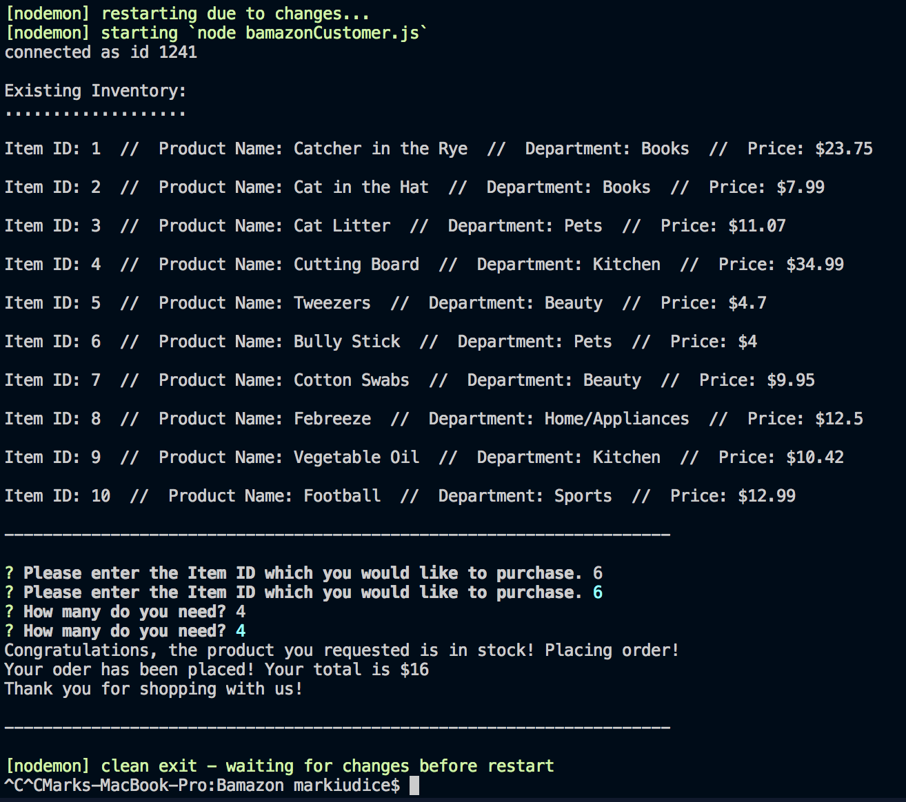

# Bamazon

This app is designed to allow you to shop on a market place through your terminal window.  Open terminal, run bamazonCustomer.js and follow the on screen prompts.

______________________________________________________________________________________________________

<!-- I was able to get the app running through the first prompt, but after that it crashes during the second.  Each time I tried to fix something to get it working something else would break along the first prompt.  I now have just the first prompt working still, but it does not properly display the item IDs anymore and I have no ideo why.

 -->

After meeting with Lindsay it turns out the issue was with the database created in phpMyAdmin.  My table had been deleted but also already existed so I couldn't recreate it.  I had to drop it and then recreate it and the app is now functioning properly.

